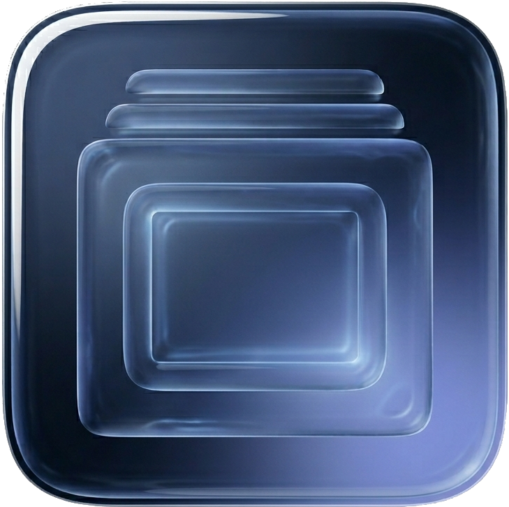

<h1 align="center">Liquid Glass Terminal</h1>

<p align="center">A GTK3 terminal emulator with real-time liquid glass refraction for Linux.</p>

<p align="center">
  <a href="https://github.com/blue0x1/liquid-glass/releases">
    
  </a>
  <a href="https://github.com/blue0x1/liquid-glass/stargazers">
    
  </a>
  
  
  
</p>

<p align="center">
  
</p>

## Demo

https://github.com/user-attachments/assets/edaa4c62-0834-4f24-9c17-2383366954b6

## Screenshot

<p align="center">
  

  
</p>

## Desktop Support

| Desktop | Glass Mode | Quality |
|---|---|---|
| KDE Plasma (KWin) | Native KWin compositor effect | Full real-time refraction of the actual desktop behind the window, no feedback loop |
| GNOME | App-side OpenGL fallback | XGetImage screen capture with blur and refraction shader |
| XFCE | App-side OpenGL fallback | XGetImage screen capture with blur and refraction shader |
| MATE | App-side OpenGL fallback | XGetImage screen capture with blur and refraction shader |
| i3 / Openbox / other X11 | App-side OpenGL fallback | XGetImage screen capture with blur and refraction shader |
| Wayland (any DE) | Shader fallback | Pure shader gradient, no screen capture |

## Features

- Native KWin compositor effect for KDE Plasma: captures the actual desktop at compositor level, applies refraction, chromatic aberration, Blinn-Phong specular, fresnel, and frosted grain via GLSL
- App-side OpenGL refraction fallback using X11 screen capture for non-KDE sessions
- KWin blur-behind support (Plasma desktop)
- Tabbed terminal sessions with rename and reorder
- Collapsible sidebar with tab navigator
- Live settings window, change theme color and glass opacity in real time
- macOS-style window controls
- 9 built-in color themes: Blue Frost, Graphite, Red, Blue, Yellow, Purple, Pink, Black, Gray
- Custom hex color picker
- Config persisted to `~/.config/liquid_glass/config`

## Install

### Debian / Ubuntu (.deb)

```bash
sudo dpkg -i liquid-glass_1.0.0_amd64.deb
```

### Build from source

**Dependencies:**

```bash
sudo apt install gcc libgtk-3-dev libvte-2.91-dev libx11-dev libepoxy-dev libgl-dev xxd
```

**Compile:**

```bash
make
```

**Install binary, icon and desktop launcher:**

```bash
sudo make install
```

**Run:**

```bash
./liquid_glass_gtk
```

### KWin Native Effect (KDE Plasma only)

For true compositor-level glass refraction on KDE Plasma, build and install the native KWin effect:

**Dependencies:**

```bash
sudo apt install cmake kwin-dev qt6-base-dev libkf6coreaddons-dev extra-cmake-modules
```

**Build and install:**

```bash
sudo make kwin-native-install
```

This installs the KWin plugin and enables it automatically. The effect captures the composited desktop behind the terminal window directly in the compositor, with no X11 screen capture and no feedback loop.

**Build .deb package:**

```bash
make deb
```

## Keyboard Shortcuts

| Shortcut | Action |
|---|---|
| `Ctrl+T` | New tab |
| `Ctrl+W` | Close tab |
| `Ctrl+Tab` | Next tab |
| `Ctrl+Shift+Tab` | Previous tab |
| `Ctrl+Shift+C` | Copy |
| `Ctrl+Shift+V` | Paste |
| `Ctrl+\` | Toggle sidebar |
| `Ctrl+,` | Open settings |

## Configuration

Config file: `~/.config/liquid_glass/config`

```ini
glassOpacity=0.12
themePreset=original
themeCustomHex=#050D1C
showSidebar=0
```

## License

MIT © 2026 Chokri Hammedi
